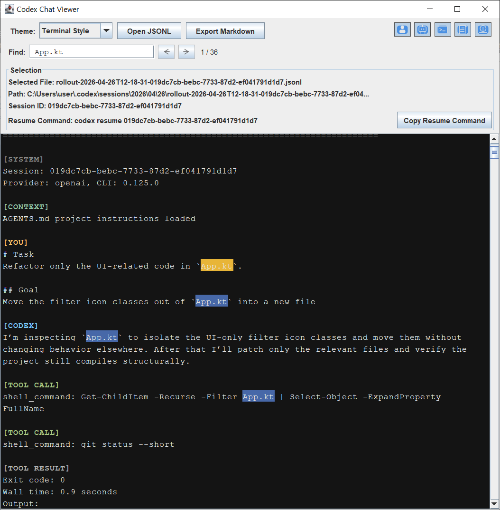

# Codex Chat Viewer

A local desktop viewer for OpenAI Codex CLI session logs.

Codex Chat Viewer opens local Codex CLI JSONL session logs, usually named `rollout-*.jsonl`, and turns them into readable, filterable conversations that you can also export to Markdown.

> Status: usable MVP

## Why?

Codex CLI is useful, but its local JSONL session logs are not easy to read as-is.

This project makes those logs easier to review by separating human prompts, Codex responses, tool calls, tool results, task context, and session metadata in a readable local UI.

It works as a companion viewer for Codex CLI sessions, making local session logs easier to inspect, review, document, and revisit after the work is done.

## Important Note About Codex Rollout Logs

Codex Chat Viewer reads local Codex CLI JSONL session logs. These are typically named `rollout-*.jsonl`.

These files are treated as an observed local session format, not as an official stable public export format.

The parser is based on rollout structures currently seen in local Codex CLI logs, and those structures may change in future Codex CLI versions. The file picker accepts `*.jsonl` files, but the viewer is designed around these observed rollout log shapes.

If OpenAI later provides a stable official session export format, this project may add support for it as a separate input adapter.

## What It Does

Codex Chat Viewer is for developers who want to review local Codex CLI sessions without reading raw JSONL logs.

The app currently focuses on:

- opening local Codex rollout logs
- rendering readable conversation blocks
- showing who or what produced each block
- collapsing and expanding conversation blocks inline
- filtering noisy sections such as tool calls, tool results, or metadata
- searching within the currently rendered transcript
- exporting the transcript based on the current filter icon state to Markdown
- keeping everything local

## Features

### Implemented

- Kotlin/JVM Gradle application
- Swing-based desktop app
- Local-first desktop workflow
- JSONL file picker with `*.jsonl` filter
- Safe Codex sessions directory detection:
  - `CODEX_HOME/sessions`
  - `~/.codex/sessions`
  - user home fallback
- Last selected directory remembered during the current app session
- Selected file metadata display
- Conservative Codex session ID detection
- `codex resume <session-id>` display when a session ID is detected
- Copy Resume Command button
- Minimal JSONL parsing for Codex rollout logs
- Speaker/source labels:
  - `[SYSTEM]`
  - `[CONTEXT]`
  - `[TASK]`
  - `[YOU]`
  - `[CODEX]`
  - `[TOOL CALL]`
  - `[TOOL RESULT]`
- Duplicate suppression for known duplicate rollout event shapes
- AGENTS.md / project instruction context separated from direct user prompts
- Task prompt document content separated as `[TASK]` when safely identifiable
- UTF-8 file reading
- Unicode-friendly viewer rendering
- Terminal-style dark viewer
- DM Style component-based direct message rendering with right-aligned `[YOU]`, left-aligned `[CODEX]`, and centered metadata cards
- Messenger Style component-based conversation rendering with right-aligned `[YOU]`, left-aligned `[CODEX]`, and centered metadata cards
- Styled label colors for faster scanning
- Soft-wrapped main viewer without horizontal scrolling
- Inline collapse / expand for transcript blocks
- Theme-driven toggle markers for block headers
- Compact icon filter toggles:
  - YOU
  - CODEX
  - CALL
  - RESULT
  - META
- Cached parsed entries with filter-based re-rendering
- In-view transcript search with `Ctrl+F`
- Case-insensitive match highlighting for the currently rendered transcript
- Previous / next match navigation:
  - `Enter` for next
  - `Shift+Enter` for previous
  - wraps around from the last result back to the first
- Search state resets when opening a new JSONL file
- Search highlights are recalculated after filter changes
- Search highlights do not affect Markdown export
- Collapse / expand state is local to the currently rendered transcript view
- Footer stats:
  - parsed candidates
  - visible entries
  - ignored lines
  - malformed lines
- Markdown export based on the current filter icon state
- Markdown export avoids raw JSONL and hidden filtered entries
- Markdown export includes safe metadata:
  - source file name
  - source file path
  - session ID if detected
- Markdown transcript body is stored inside a fenced `text` block
- UTF-8 Markdown file writing
- Safe Markdown export filename handling:
  - suggests a non-conflicting default file name when possible
  - asks before overwriting an existing file
- Opens Windows File Explorer with the exported Markdown file selected after export
- Portable Windows zip build task

### Planned

- Theme rendering:
  - Terminal Style refinement
  - Markdown Style
- Live tail / watch mode for active Codex sessions
- Optional support for a stable official Codex session export format, if one becomes available

## Markdown Export

The Markdown export feature saves the transcript based on the current filter icon state.

If a message type is hidden in the viewer, it is not included in the exported Markdown file. Collapsed blocks are exported with their full content.

Search highlights and the current search query do not affect the exported Markdown output.

The exported file keeps the terminal-style transcript format instead of turning the conversation into a polished article-style Markdown document.

Example shape:

````md
# Codex Chat Viewer Export

Source file: rollout-xxxx.jsonl  
Path: C:\Users\user\.codex\sessions\...\rollout-xxxx.jsonl  
Session ID: xxxx

```text
[YOU]
...

[CODEX]
...

[TOOL CALL]
...

[TOOL RESULT]
...
```
````

When exporting, the app suggests a Markdown filename based on the selected JSONL file. If a matching `.md` file already exists, the app suggests a non-conflicting filename such as `name (1).md`. If you explicitly select an existing file, the app asks before overwriting it.

After a successful export, Windows File Explorer opens with the exported `.md` file selected.

## Search

Codex Chat Viewer includes in-view search for the text currently rendered in the main transcript area.

- Press `Ctrl+F` to open the search bar.
- Press `Ctrl+F` again or `Esc` to close it.
- Type to highlight matching text in the currently visible transcript.
- Press `Enter` to move to the next match.
- Press `Shift+Enter` to move to the previous match.
- Search is case-insensitive by default.

Search works on the currently rendered transcript, not on hidden filtered entries. If a section is hidden by the filter toggles, it is not searched until it is visible again.

## Screenshots



## Requirements

- JDK 21 or later
- Windows is the primary development target
- Gradle Wrapper included

The project uses the included Gradle Wrapper, so you do not need to install Gradle manually after cloning.

## Run

### Windows

```cmd
gradlew.bat run
```

## Manual Windows Release Zip

Codex Chat Viewer is intended to ship as a portable Windows zip, not as a full installer.

Build the local release artifact with:

```cmd
gradlew.bat packageWindowsReleaseZip
```

The generated files are written under the build output directory:

```text
app/build/release/windows/app-image/
app/build/release/windows/codex-chat-viewer-windows-x64.zip
```

The zip is intended for manual upload to GitHub Releases after a local check. The expected user flow is:

- build `codex-chat-viewer-windows-x64.zip` locally
- extract the zip
- run `Codex Chat Viewer.exe`
- verify the app opens without a separate Java install
- upload the zip to GitHub Releases manually

`jpackage` is required for the release build because the release zip bundles a Java runtime. If `jpackage` is not already on `PATH`, point the build to a full JDK by setting `JPACKAGE_HOME` or `JPACKAGE_EXECUTABLE`.

The source-code zip from GitHub's green `Code` button is not the same as the portable release zip. End users should download the release asset instead of the source archive.

## Development Notes

Codex Chat Viewer reads local Codex CLI session logs from paths such as:

```text
~/.codex/sessions
```

or:

```text
%CODEX_HOME%/sessions
```

The app does not upload logs anywhere.

Codex rollout logs may contain prompts, code, file paths, shell commands, command outputs, tool calls, and private project information. Treat local session files carefully.

Exported Markdown files may also contain private session content. Review them before sharing.

## Privacy

This is a local-first utility.

- No network behavior is required for viewing logs.
- Real Codex session logs should not be committed.
- Private local samples should remain ignored.
- Exported files may contain private session content, so review them before sharing.

## Release Direction

The intended release format is a portable Windows zip:

```text
Download zip
Extract folder
Run Codex Chat Viewer.exe
```

A full installer is not the first target. The portable zip should include a bundled runtime so Java does not need to be installed separately on the target machine.

## License

MIT License
